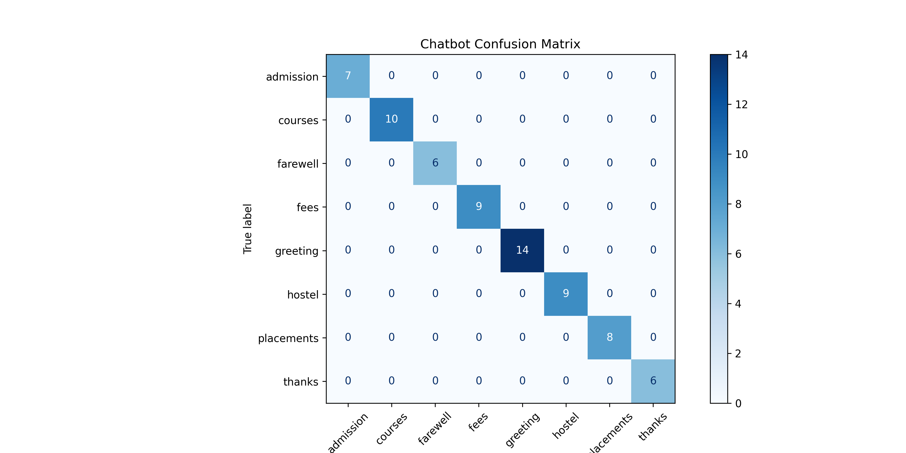

# 🤖 NLP-Based AI Chatbot using TF-IDF

An intelligent AI-powered chatbot developed using **Python** and **Natural Language Processing (NLP)**. This chatbot understands college-related queries using **TF-IDF Vectorization** and **Cosine Similarity**, providing accurate and relevant responses instead of relying only on keyword matching.

---

## ✨ Project Overview

This project demonstrates the practical implementation of Natural Language Processing techniques for building an intelligent chatbot. User queries are preprocessed, converted into TF-IDF vectors, and matched with stored questions using Cosine Similarity to generate the most appropriate response.

---

## 🚀 Features

- 💬 Intelligent college assistant chatbot
- 🧠 NLP-based text understanding
- 🔍 TF-IDF Vectorization
- 📊 Cosine Similarity matching
- ⚡ Fast and accurate responses
- 📝 Text preprocessing using NLTK
- 💾 Trained TF-IDF model saved as a `.pkl` file
- 📈 Confusion Matrix for model evaluation

---

## 🛠️ Technologies Used

- 🐍 Python
- 📚 NLTK
- 🤖 Scikit-learn
- 🔢 NumPy
- 💾 Pickle
- 📊 TF-IDF Vectorizer
- 📈 Cosine Similarity
- 💻 Google Colab
- 🌐 GitHub

---

## 📂 Project Files

- 📓 Task2_NLP_Chatbot.ipynb
- 🐍 task2_nlp_chatbot.py
- 📄 Task2_NLP_Chatbot_Report.pdf
- 🖼️ Task_2 Chatbot Screenshot.png
- 💾 chatbot_tfidf.pkl
- 📊 chatbot_confusion_matrix.png

---

## 📸 Chatbot Output

The chatbot successfully answers college-related queries such as:

- 🎓 Admissions
- 💰 Fees
- 🏨 Hostel
- 📚 Courses
- 💼 Placements
- 🙋 Greetings
- 👋 Farewell

---

## 📊 Confusion Matrix

The confusion matrix below demonstrates the performance of the NLP-based chatbot in identifying user intents.

---

## 🚀 Future Improvements

- 🌐 Web-based chatbot interface
- 🎤 Voice-based interaction
- 🌍 Multi-language support
- 🤖 Deep Learning & Transformer models
- ☁️ Deployment using Flask or Streamlit

---

## 👩‍💻 Author

**Adeeba Nousheen**

B.Tech – Artificial Intelligence & Machine Learning

---

⭐ If you found this project useful, don't forget to Star this repository!
